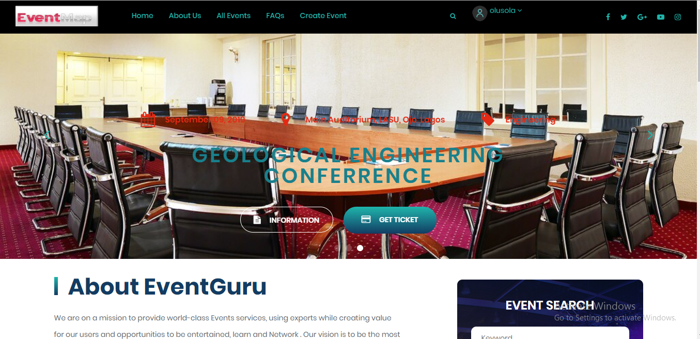
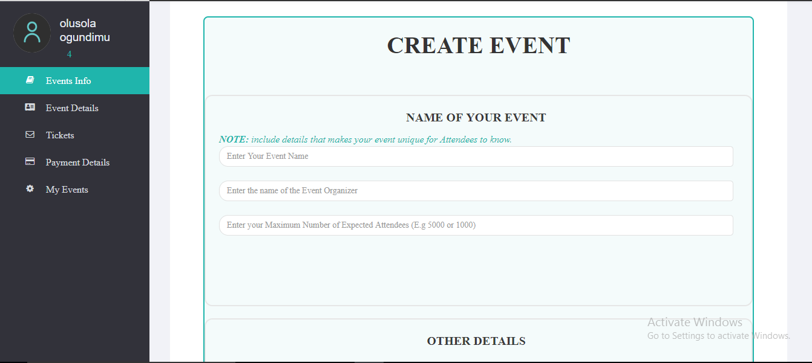
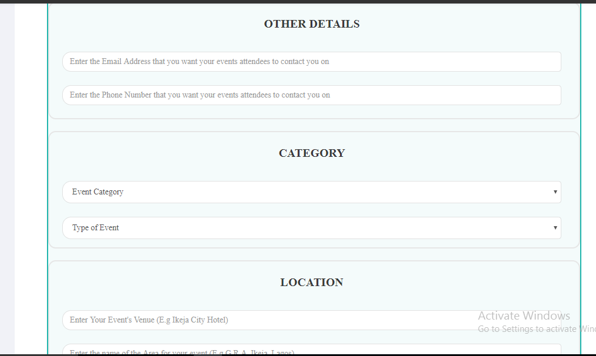
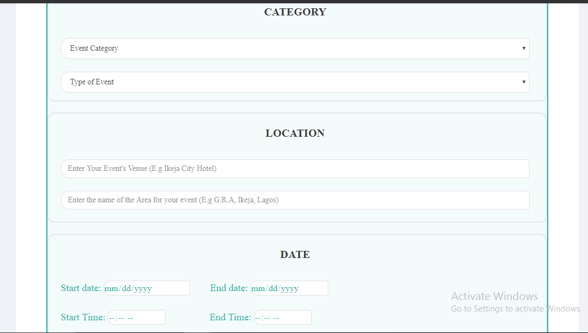
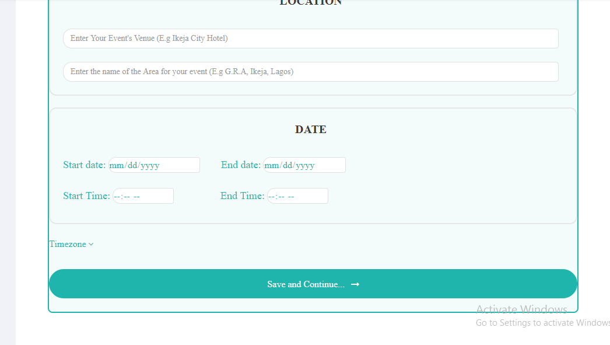
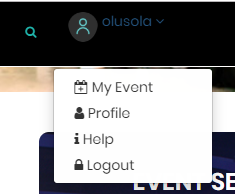
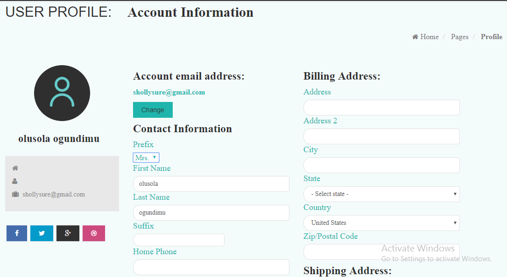
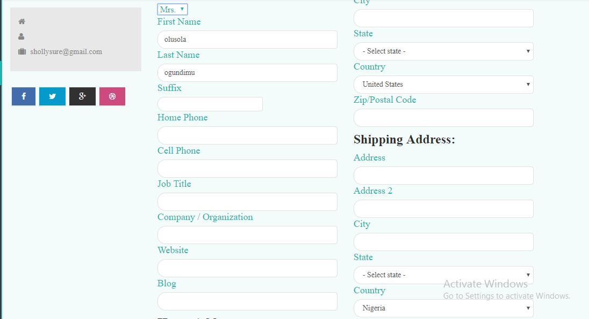
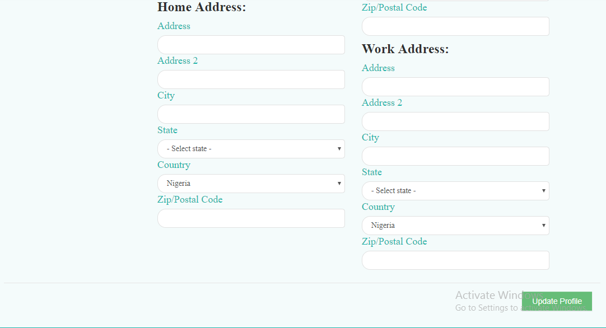
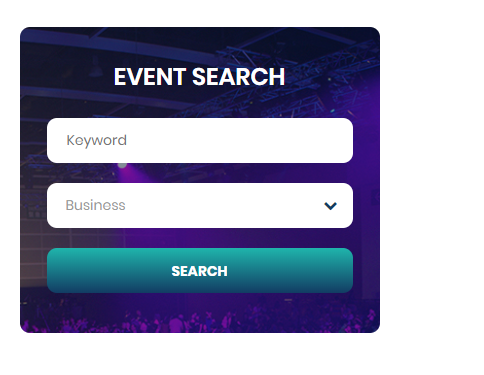

## INTRODUCTION
Event guru is an application on which people can create event,register for an event,search and connect with vendors, social network  and request for event management service.The URL for event guru is http://eventguru.ng/

## INVITE/SUBSCRIBE
User can buy view details of an event and buy ticket if interested. Also view the speakers profile

One can also create event on the platform .

## FACILITATOR PROFILE

## ATTENDEE PROFILE

## SOCIAL NETWORKING
 
 

## SEARCH FOR EVENT
people can search for event based on the type of event

