## INTRODUCTION

 Field sales is the process by which companies visit leads and sell to them in person.It enables the sales manager keep track of all their sales representatives activities. Field Sales is in 2 section, the web application for the admin and mobile application for the sales representative.Some of the features of Field sales application include route plane. inventory,orders,analytics,outlets, schedule .The URL for the admin is http://salesmanager.ng/login.

## ADMIN MENU

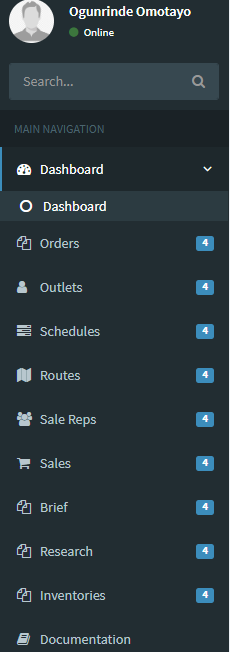

## ADMIN PROFILE

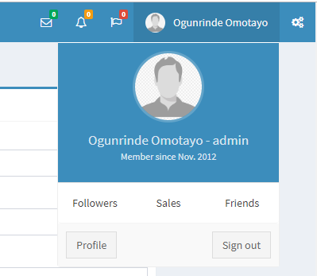

## DASHBOARD

On the dashboard, you have the overview of all the activities going in the application

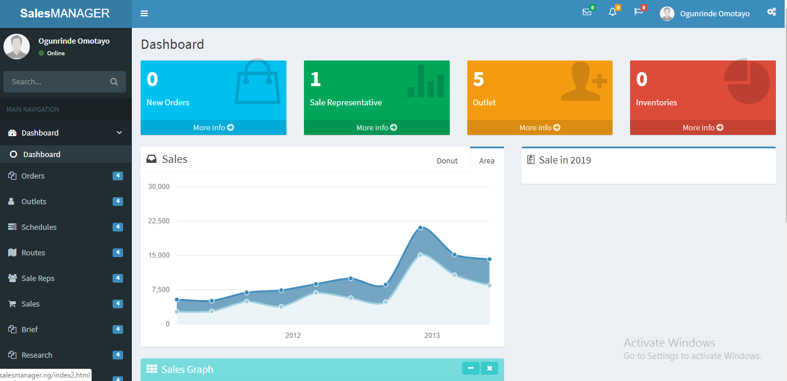

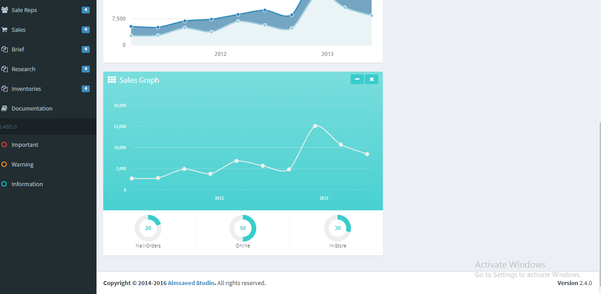

## ROUTE PLANS

 In the route plan, sales manager can view all the sales representatives location to be visited.

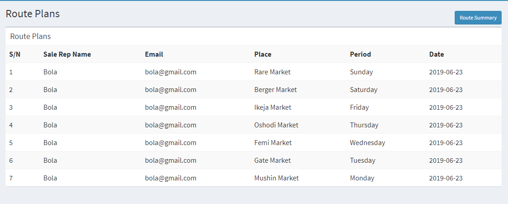

In the route summary, the sales manager can filter the route plan of their  sales representative  individually.

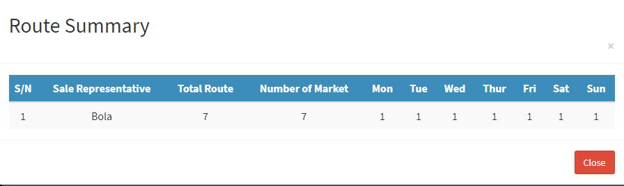

## INVENTORY

In the inventory, the sales manager will be able to add inventory and view inventory.

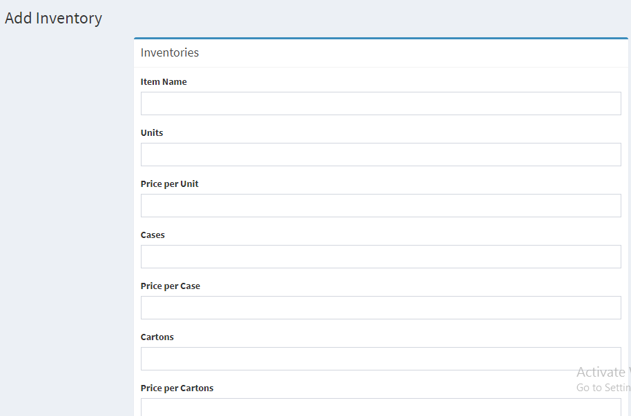

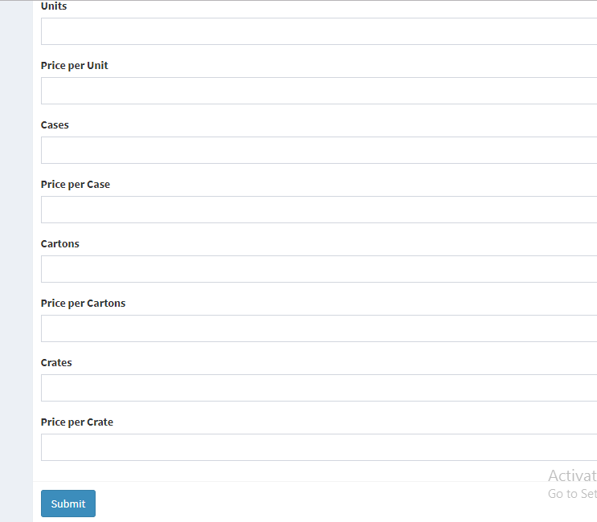

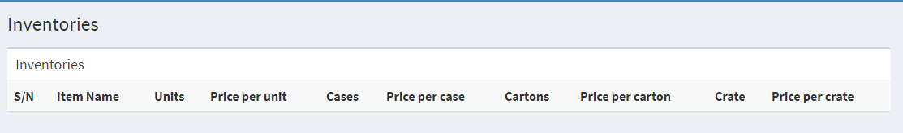

## ORDERS

The sales manager keep track of all the orders logged in by the sales representative.

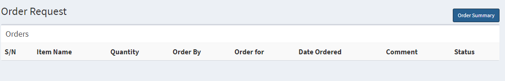
 
 In the order summary, the sales manager will be able to filter all the orders logged in by each sales representative and also by the month.

 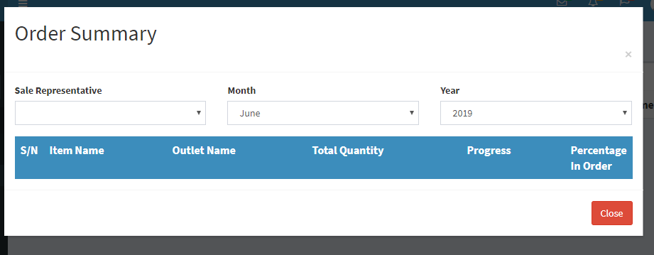

## BRIEFS

For the briefs menu, if the sales manager has any information to pass to the sales representative it is done on this platform and if the sales representative has any information, it is done on this platform.

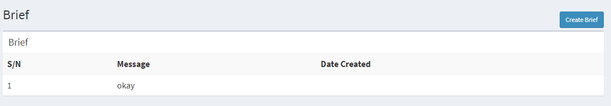

## OUTLET

The outlets comprises of all the shops, stores and supermarket they sell to

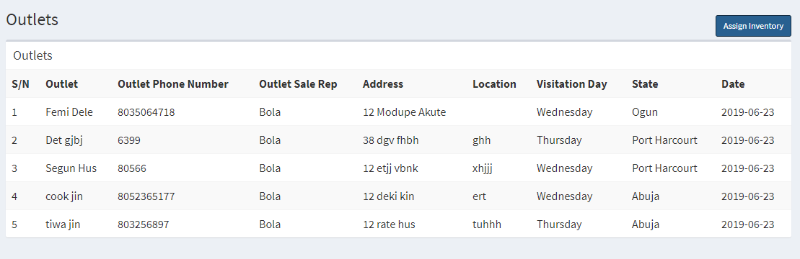

## SALES REP

The sales manager can add sales rep and view all the sales rep. Also the sales manager can assign quantity of product to each sales representative.

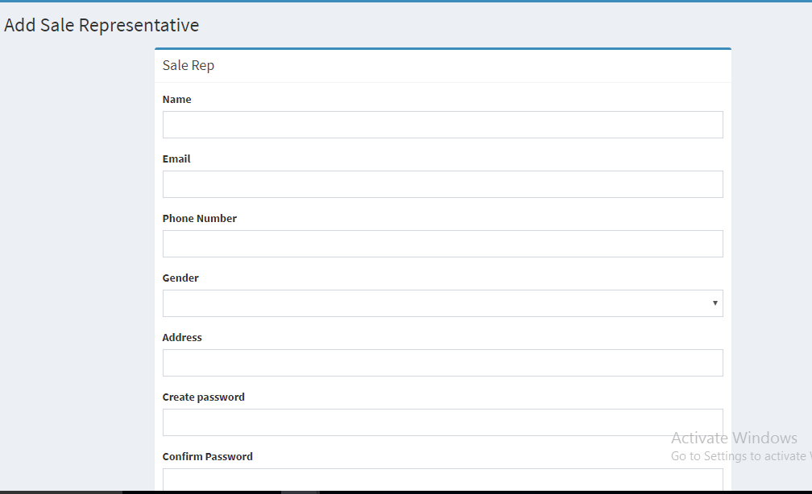

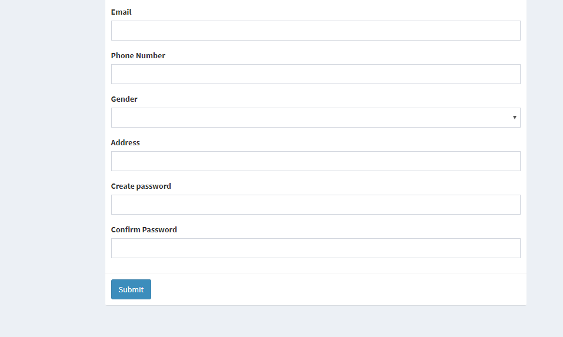

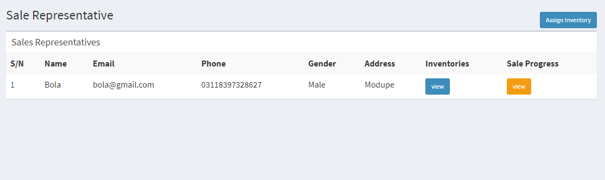

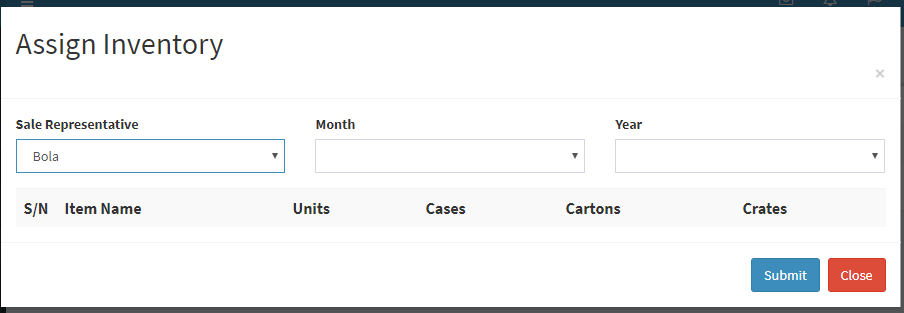

## SALES

In the sales platform, the sales manager can view the monthly sales report of every sales represenative.

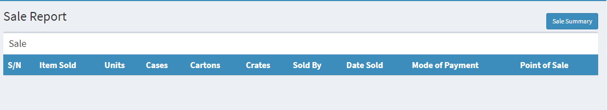

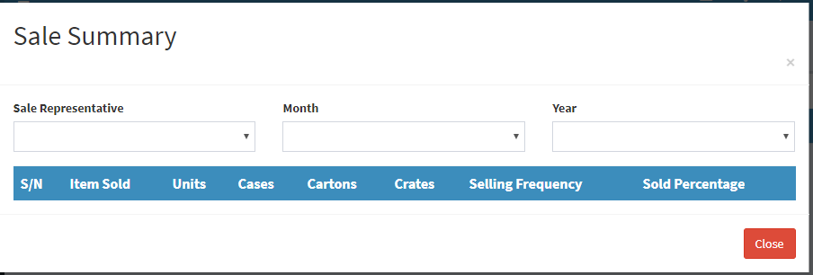

## SCHEDULE

The sales manager can view all the sales representatives schedule for the day and also filter it based on the month or sales representative name.

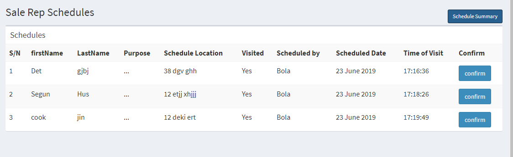

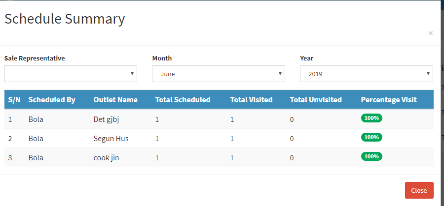

## MARKET RESEARCH

The sales manager can view all the market research made by the sales representative
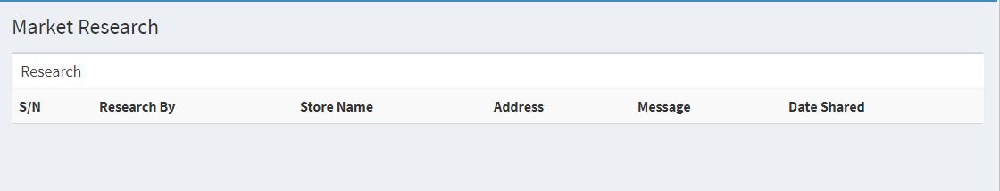

